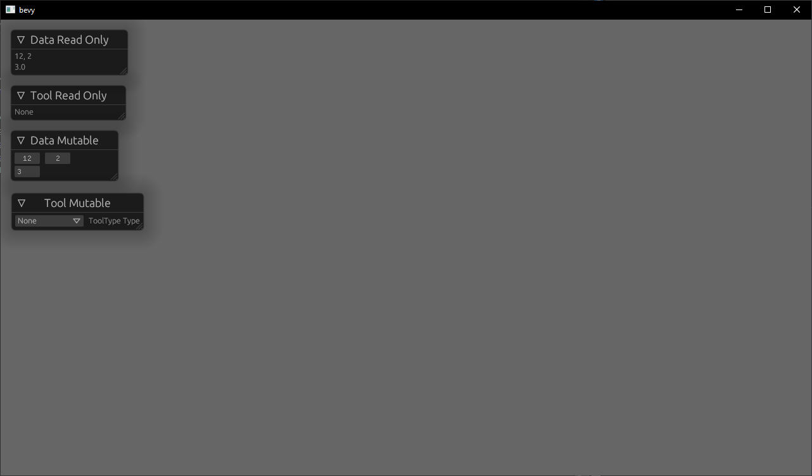

# `bevy_egui_debug`

This crate extends [bevy_egui](https://github.com/mvlabat/bevy_egui) with a macro to make debugging a little easier

# Usage
Minimal Example `cargo run --example demo`
```rust
[dependencies]
bevy = "0.5"
bevy_egui = "0.7"
bevy_egui_debug = {git = "https://github.com/eric556/bevy_egui_debug"}
```

```rust
use bevy::prelude::*;
use bevy_egui::{egui, EguiContext, EguiPlugin};
use bevy_egui_debug::{EguiDebug, EguiDebugDerive};

#[derive(Debug, PartialEq, EguiDebugDerive)]
enum ToolType {
    Hoe,
    WateringCan,
    None
}

#[derive(Debug, EguiDebugDerive)]
struct SomeData {
    point: Vec2,
    more_data: f32
}

fn main() {
    App::build()
        .add_plugins(DefaultPlugins)
        .add_plugin(EguiPlugin)
        .add_startup_system(spawn.system())
        .add_system(debug_mut_system.system())
        .add_system(debug_system.system())
        .run();
}

fn spawn(
    mut commands: Commands
) {
    commands.spawn().insert(ToolType::WateringCan);
    commands.spawn().insert(SomeData {
        point: Vec2::new(1.0, 2.0),
        more_data: 3.0,
    });
}

fn debug_mut_system(
    egui_context: ResMut<EguiContext>,
    mut data_query: Query<&mut SomeData>,
    mut tool_query: Query<&mut ToolType>,
) {
    egui::Window::new("Data Mutable").show(egui_context.ctx(), |ui| {
        for mut data in data_query.iter_mut() {
            data.debug_mut(ui);
        }
    });

    egui::Window::new("Tool Mutable").show(egui_context.ctx(), |ui| {
        for mut tool in tool_query.iter_mut() {
            tool.debug_mut(ui);
        }
    });
}

fn debug_system(
    egui_context: ResMut<EguiContext>,
    data_query: Query<&SomeData>,
    tool_query: Query<&ToolType>,
) {
    egui::Window::new("Data Read Only").show(egui_context.ctx(), |ui| {
        for data in data_query.iter() {
            data.debug(ui);
        }
    });

    egui::Window::new("Tool Read Only").show(egui_context.ctx(), |ui| {
        for tool in tool_query.iter() {
            tool.debug(ui);
        }
    });
}
```



# Bevy support
|bevy|bevy_egui|bevy_egui_debug|
|---|---|---|
|0.5|0.7|main|
